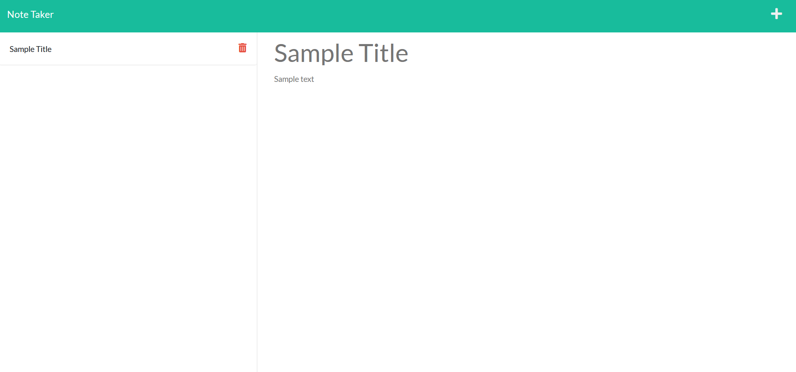

# Note Taker
## Description
Save notes and delete them when you're done with them.  

## Usage
[Follow the link to the application](https://guarded-wave-81044.herokuapp.com/) and click on the get started button
Click the new note button in the top right to open text fields to enter a note title and note text.  
When text is entered into both fields, click the save note icon to save the note to the server.  
Click on a note's name on the right hand side to display its text.  
Click on the red delete icon next to a note's name to delete that note.

## Tests
Tests for this application are handled by Jest.

## Developed by
Backend Javascript developed by [Jacob Brister](https://github.com/jbrister71).